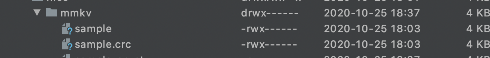
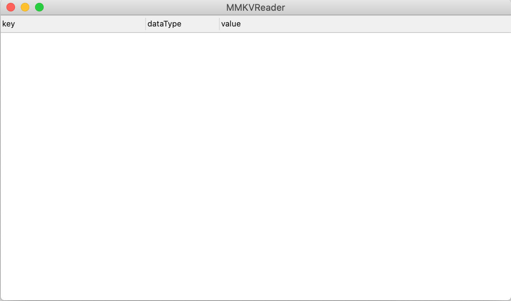
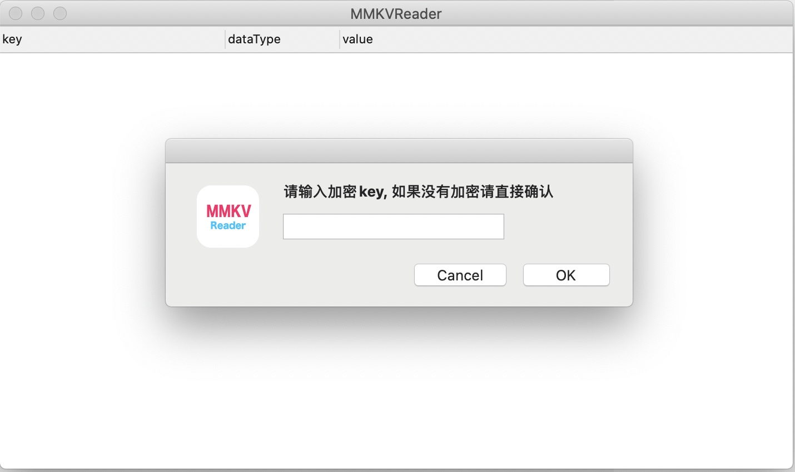
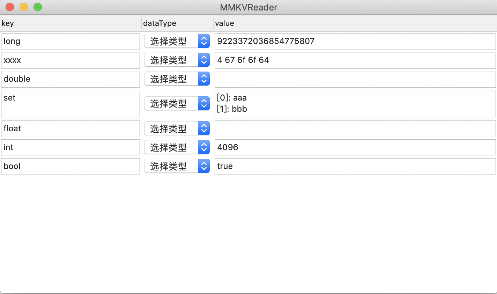

# MMKVReader
MMKV Data File Reader for MacOS. MacOS上[MMKV](https://github.com/Tencent/MMKV/)的数据文件解析工具.

## 使用方式
> 同时拖入MMKV数据文件和crc文件到应用界面，Android的数据文件格式如下

## 应用截图

### 启动应用

### 同时拖入数据文件 + crc文件

### 选择数据类型解析文件
